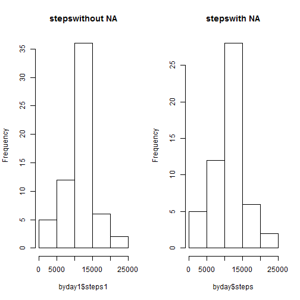
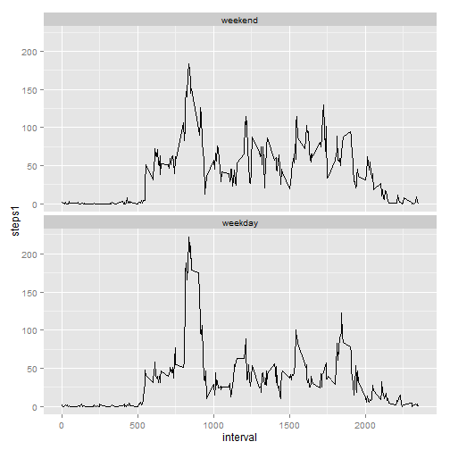

# Assignment 

## Loading and preprocessing the data


```r
activity <- read.csv("activity.csv",header = TRUE)
head(activity)
```

```
##   steps       date interval
## 1    NA 2012-10-01        0
## 2    NA 2012-10-01        5
## 3    NA 2012-10-01       10
## 4    NA 2012-10-01       15
## 5    NA 2012-10-01       20
## 6    NA 2012-10-01       25
```

```r
class(activity$date)
```

```
## [1] "factor"
```
the variable date is not in the rigth format
transform date in POSIXct class

```r
library(lubridate)
activity$date<- ymd(activity$date) #transform class
class(activity$date)
```

```
## [1] "POSIXct" "POSIXt"
```

## What is mean total number of steps taken per day?
This table shows the sum of steps per day.

```r
byday <-aggregate(steps~date, sum, data=activity, na.rm=TRUE )
```

1. and this is the histogram of the total number of steps taken each day

```r
library(ggplot2)
h <- ggplot(byday, aes(steps))
h + geom_histogram()
```

```
## stat_bin: binwidth defaulted to range/30. Use 'binwidth = x' to adjust this.
```

 

2.Mean and median of the total number of steps taken PER DAY

```r
library(dplyr)
basicstats <- summarise(group_by(activity, date), mean.steps = mean(steps), median.steps= median(steps))
summary(basicstats)
```

```
##       date              mean.steps       median.steps
##  Min.   :2012-10-01   Min.   : 0.1424   Min.   :0    
##  1st Qu.:2012-10-16   1st Qu.:30.6979   1st Qu.:0    
##  Median :2012-10-31   Median :37.3785   Median :0    
##  Mean   :2012-10-31   Mean   :37.3826   Mean   :0    
##  3rd Qu.:2012-11-15   3rd Qu.:46.1597   3rd Qu.:0    
##  Max.   :2012-11-30   Max.   :73.5903   Max.   :0    
##                       NA's   :8         NA's   :8
```
## What is the average daily activity pattern?
1. Make a time series plot of the 5-minute interval (x-axis) and the average number of steps taken, averaged across all days (y-axis)

```r
library(ggplot2)
bymin <- aggregate(steps~interval, mean, data=activity, na.rm=TRUE)
ggplot(bymin, aes(x=interval, y=steps))+geom_line() 
```

 

2. Which 5-minute interval, on average across all the days in the dataset, contains the maximum number of steps?

```r
which(bymin == max(bymin$steps), arr.ind=T)
```

```
##      row col
## [1,] 104   2
```

```r
bymin[104,1]
```

```
## [1] 835
```
the interval with the maximum number of steps in average is the 835 interval (row 104) with 206.19 steps in average

## Imputing missing values
1. Calculate and report the total number of missing values in the dataset (i.e. the total number of rows with NAs)

```r
summary(activity)
```

```
##      steps             date               interval     
##  Min.   :  0.00   Min.   :2012-10-01   Min.   :   0.0  
##  1st Qu.:  0.00   1st Qu.:2012-10-16   1st Qu.: 588.8  
##  Median :  0.00   Median :2012-10-31   Median :1177.5  
##  Mean   : 37.38   Mean   :2012-10-31   Mean   :1177.5  
##  3rd Qu.: 12.00   3rd Qu.:2012-11-15   3rd Qu.:1766.2  
##  Max.   :806.00   Max.   :2012-11-30   Max.   :2355.0  
##  NA's   :2304
```
there are 2304 NAs in the dataset

2. Devise a strategy for filling in all of the missing values in the dataset. 

```r
# replace Na with the average of the interval the new datase has de original steps and the new one
# without NAs (steps1)
newactivity <-activity %>% group_by(interval)  %>% mutate(steps1= as.numeric(ifelse(is.na(steps), mean(steps, na.rm = TRUE), steps)) )
summary(newactivity)
```

```
##      steps             date               interval          steps1      
##  Min.   :  0.00   Min.   :2012-10-01   Min.   :   0.0   Min.   :  0.00  
##  1st Qu.:  0.00   1st Qu.:2012-10-16   1st Qu.: 588.8   1st Qu.:  0.00  
##  Median :  0.00   Median :2012-10-31   Median :1177.5   Median :  0.00  
##  Mean   : 37.38   Mean   :2012-10-31   Mean   :1177.5   Mean   : 37.38  
##  3rd Qu.: 12.00   3rd Qu.:2012-11-15   3rd Qu.:1766.2   3rd Qu.: 27.00  
##  Max.   :806.00   Max.   :2012-11-30   Max.   :2355.0   Max.   :806.00  
##  NA's   :2304
```

3Make a histogram of the total number of steps taken each day and Calculate and report the mean and median total number of steps taken per day. Do these values differ from the estimates from the first part of the assignment? What is the impact of imputing missing data on the estimates of the total daily number of steps?

```r
byday1 <-aggregate(steps1~date, data=newactivity, sum)
h1 <- ggplot(byday1, aes(steps1))
par(mfrow=c(1,2))
hist(byday1$steps1, main="stepswithout NA")
hist(byday$steps, main="stepswith NA")
```

 

```r
summary(newactivity$steps, na.rm=T)
```

```
##    Min. 1st Qu.  Median    Mean 3rd Qu.    Max.    NA's 
##    0.00    0.00    0.00   37.38   12.00  806.00    2304
```

```r
summary(newactivity$steps1)
```

```
##    Min. 1st Qu.  Median    Mean 3rd Qu.    Max. 
##    0.00    0.00    0.00   37.38   27.00  806.00
```
The two histograms do not differs too mucho between them, this assures that the strategy of imputing do not has a significative impact in the statistics, the mean remain the same, there is a slightly change in the 3rd quartile.

##Are there differences in activity patterns between weekdays and weekends?
1. Create a new factor variable in the dataset with two levels - "weekday" and "weekend" indicating whether a given date is a weekday or weekend day.

```r
# this code transform first the dates in day ans then I use fator to classify the days in weekday and weekend
week <- newactivity [,2:4]
week <-mutate (week, date=weekdays(date))

weekdays1 <- c('lunes', 'martes', 'miercoles', 'jueves', 'viernes')
week$wDay <- factor((week$date %in% weekdays1), levels=c(FALSE, TRUE), labels=c('weekend','weekday'))
#aggregate using the average steps per interval
weekaverage <- aggregate(steps1~interval+wDay, mean, data=week)
```

2. Make a panel plot containing a time series plot of the 5-minute interval (x-axis) and the average number of steps taken, averaged across all weekday days or weekend days (y-axis)

```r
ggplot(weekaverage, aes(x=interval, y=steps1, group=wDay))+ geom_line() + facet_wrap(~wDay, nrow = 2)
```

 
